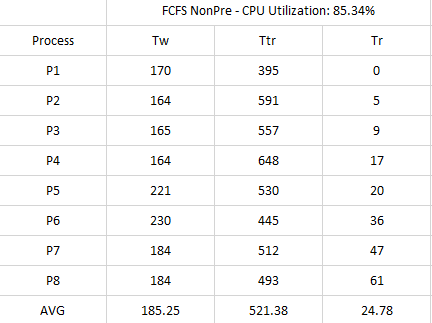
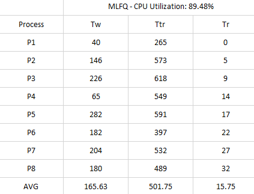

# CPU Scheduler Simulation
## Team Fire
- Jared Scarr 
- Derrek Do
- Mike Murphy

## Table of Contents
1. [Introduction](#introduction)

2. [Algorithms](#algorithms)
   - [First Come First Served](#first-come-first-served)
   - [Shortest Job First](#shortest-job-first)
   - [Priority](#priority)
   - [Round-Robin](#round-robin)
   - [Multi-level Queue](#multi-level-queue)
   - [Multi-level Feedback Queue](#multi-level-feedback-queue)
8. [Process](#process)
8. [UML Diagram](#uml-diagram)
9. [Data](#results)
   - [First Come First Served Results](#first-come-first-served-results)
   - [Shortest Job First Results](#shortest-job-first-results)
   - [Priority Results](#priority-results)
   - [Round-Robin Results](#round-robin-results)
   - [Multi-level Queue Results](#multi-level-queue-results)
   - [Multi-level Feedback Queue Results](#multi-level-feedback-queue-results)
16. [Conclusion](#conclusion)

## Introduction

The goals of this project were to implement several scheduling algorithms to simulate CPU scheduling.
Then compare and contrast the results based on an agreed upon criteria. In comparing these algorithms
the criteria used is: CPU utilization, throughput, turnaround time, waiting time, and response time.

## Algorithms

### First Come First Served

How this queue works is pretty well outlined by its name. The processes are run in the order
received with no preemption.

This algorithm checks the ready queue and removes the first process in it and runs it for its current CPU burst duration.
Once ran, the process gets sent to I/O and stays there until it's I/O burst finishes. The next process in the queue
is then ran for its current CPU burst duration. If any process is in I/O its I/O burst will decrease based on the current running
process CPU burst, once the I/O burst finishes it is sent back to the ready queue. This algorithm continues to run until all processes 
have finished all of its I/O and CPU bursts.

Implementing the FCFS algorithm started off as a difficult task, as their was multiple things that needed to be checked before, during, and after a process ran.
I had to slowly run the program and make sure numbers looked right at each instance. The sample FCFS data file provided helped me recognize that I was implementing
the algorithm properly, and have the algorithm finish running with all the correct data.

### Priority

This algorithm processes the next burst with the highest priority first. The priority can
be a set labeled number, burst duration, or something else. Whatever is selected that
priority runs first.

One major issue that arises with a strait Priority algorithm is starvation due to
new processes being added that always have a higher priority than others in the queue.
One way of solving this issue is by providing some sort of aging criteria which
would bump the priority of a process that has been in the queue for a certain amount of time.
Eventually, or probably, it would be processed. Another way to solve this is
by using a round-robin algorithm for processes that come in with the same priority level.
The algorithm that is implemented here uses this solution.

### Shortest Job First

This algorithm is a variation of the above described Priority algorithm. The priority in this
case is the length of the process job duration. As the title states the highest priority goes to
the shortest duration. There is a preemptive and non-preemptive version. The algorithm in this
report is the non-preemptive implementation.

TODO: Mike add impementation details here

### Round-Robin

In a round-robin tournament every competitor will play each other to find a winner.
In a similar fashion each process will execute against a period of time. This time
period is called a _quantum_. When a process executes a CPU burst it can only run
up to the limit of the quantum. If the CPU burst duration is longer than the quantum
allows it stops, is preempted, and then moved to the back of the ready queue to be processed
when next its turn arrives. In this fashion all the bursts get processed either in full
or in a piece at a time until completion.

### Multi-level Queue

This design has multiple queues each that hold a different priority per level. A process
comes in with a priority assigned then it is transferred to the queue that processes
that priority. There are different ways that these queues can be designed to run the processes.
One way could be that the queue that handles all the highest priority processes will
always run first before any of the other queues. Another design choice is to provide a time
slice to split up how different queues are run.

TODO: Mike add details of your implementation here

### Multi-level Feedback Queue

This queue also has levels of queues that handle different processes. In this design the processes
are split up by a characteristic of their bursts. Usually duration. So if a process does not
complete their burst within a certain time quantum (duration period) it will be moved to a lower
queue. This algorithm's underlying queues can be round-robin, priority, FCFS, etc.

This algorithm uses three queues each with their own priority level. The first queue(Q1) uses the RR schdeuling
with a time quantum of 5 and is highest level queue meaning it has absolute priority. The next queue(Q2) is also uses a RR
schdeuling but with a time quantum of 10 and has the second highest priority. The next and last queue(Q3) in this algorithm
uses a FCFS scheduling algorithm and has the lowest priority, meaning that processes in this queue will only be ran if the 
higher priority queues are both empty.

Once the algorithm runs, all process are placed in Q1. The first process that appears in that Q1 will run for the given time quantum, 
if that process completes its CPU burst in the given time quantum it will be sent to I/O retaining the same priority; once that process finishes its I/O burst it will 
move back to Q1. If any process does not finish in that time quantum, it will be prempted to Q2 and will not be able to run until Q1 is empty.
When there are no longer and processes in the Q1 ready queue, the algorithm moves on to Q2 and runs those process with Q2's given time quantum.
If a process is unable to finish in that time quantum it will be prempted to the lowest queue. 

Implementing this algorithm was much more difficult to implement as it uses 3 different ready queues each with their own priority levels.
Having to keep track of which queue a process belong to, and making sure numbers looked right made it really messy to
debug when trying to figure what went wrong in the logic as we get further in the algorithm runtime. I was eventually able 
to have it finish running and display data

## Design Process

We decided to approach this from the bottom up writing the FCFS and Round Robin algorithms
so that we could compose the Multi-level queues with them. One flaw with this logic, or at
least in our planning, was that we did not develop those algorithms to function as a part
of another algorithm. Due to the difficulty in modifying the previously implemented algorithms
the Multi-level Queue and Multi-level Feedback Queue were designed with their own logic that did
not involve the composition of previous algorithms. A design from the top down may have provided
a better perspective on how we needed those algorithms to function from the perspective of
use with the ML queues.

## UML Diagram

## Results

TODO: Insert Diagrams, tables, plots, and discussions here

TODO: Discussion should be spent comparing algorithm performance and deciding on the best solution
to implement. Why its the best solution and why not should also be discussed.

### First Come First Served Results

### Shortest Job First Results

### Priority Results

### Round-Robin Results

### Multi-level Queue Results

### Multi-level Feedback Queue Results

## Conclusion

