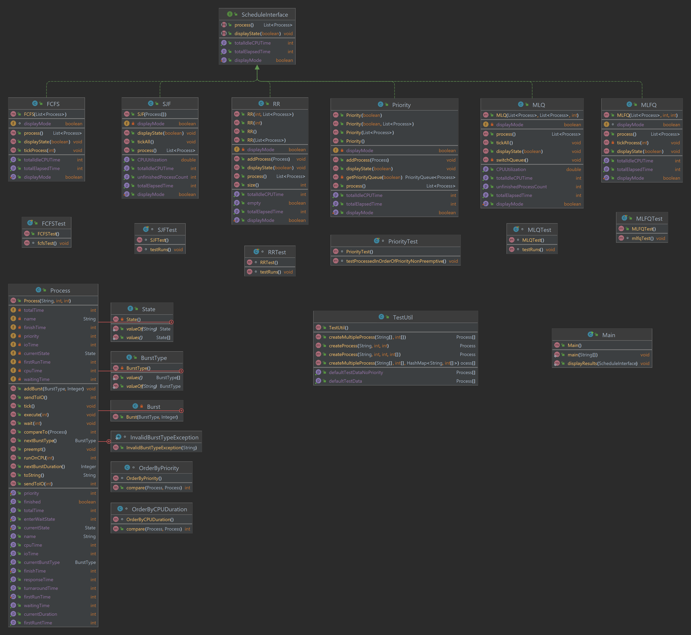
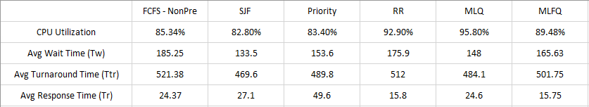
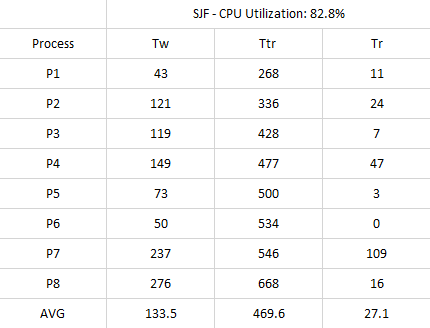
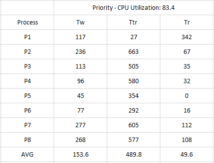
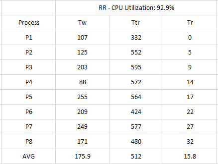
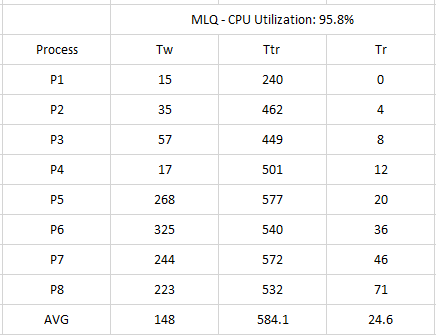

# CPU Scheduler Simulation

## Team Fire
- Jared Scarr 
- Derrek Do
- Mike Murphy

## Table of Contents
1. [Introduction](#introduction)

2. [Algorithms](#algorithms)
   - [First Come First Served](#first-come-first-served)
   - [Shortest Job First](#shortest-job-first)
   - [Priority](#priority)
   - [Round-Robin](#round-robin)
   - [Multi-level Queue](#multi-level-queue)
   - [Multi-level Feedback Queue](#multi-level-feedback-queue)
8. [Design Process](#design-process)
8. [UML Diagram](#uml-diagram)
9. [Data](#results)
   - [Average Breakdown](#average-breakdown)
   - [First Come First Served Results](#first-come-first-served-results)
   - [Shortest Job First Results](#shortest-job-first-results)
   - [Priority Results](#priority-results)
   - [Round-Robin Results](#round-robin-results)
   - [Multi-level Queue Results](#multi-level-queue-results)
   - [Multi-level Feedback Queue Results](#multi-level-feedback-queue-results)
16. [Conclusion](#conclusion)
17. [Glossary](#glossary)

## Introduction

The goals of this project were to implement several scheduling algorithms to simulate CPU scheduling,
then compare and contrast the results based on an agreed upon criteria. In comparing these algorithms,
the criteria we used are optimization of CPU utilization, turnaround time, waiting time, and response time.
Optimization is context-dependent, see the [Conclusion](#conclusion) section for discussion on this topic.

## Algorithms

### First Come First Served

How this queue works is pretty well outlined by its name. The processes are run in the order
received with no preemption.

This algorithm checks the ready queue and removes the first process in it and runs it for its current CPU burst duration.
Once ran, the process gets sent to I/O and stays there until it's I/O burst finishes. The next process in the queue
is then ran for its current CPU burst duration. If any process is in I/O its I/O burst will decrease based on the current running
process CPU burst, once the I/O burst finishes it is sent back to the ready queue. This algorithm continues to run until all processes 
have finished all of its I/O and CPU bursts.

Implementing the FCFS algorithm started off as a difficult task, as there were multiple things that needed to be checked before, during, and after a process ran.
I had to slowly run the program and make sure numbers looked right at each instance. The sample FCFS data file provided helped me recognize that I was implementing
the algorithm properly, and have the algorithm finish running with all the correct data.

### Priority

This algorithm processes the next burst with the highest priority first. The priority can
be a set labeled number, burst duration, or something else. Whatever is selected that
priority runs first.

One major issue that arises with a strait Priority algorithm is starvation due to
new processes being added that always have a higher priority than others in the queue.
One way of solving this issue is by providing some sort of aging criteria which
would bump the priority of a process that has been in the queue for a certain amount of time.
Eventually, or probably, it would be processed. Another way to solve this is
by using a round-robin algorithm for processes that come in with the same priority level.

For this experiment a starvation solution was not implemented as it was beyond the scope of
this work.

### Shortest Job First

This algorithm is a variation of the above described Priority algorithm. The priority in this
case is the length of the process job duration. As the title states, the highest priority goes to
the process with the shortest duration. The Shortest Job First algorithm can be implemented in 
either a preemptive or non-preemptive version. The algorithm in this project is the non-preemptive
implementation.  Shortest Job First improves slightly on the performance of FCFS, as processes with
long runtimes do not block the CPU and starve shorter jobs for long periods.

### Round-Robin

In a round-robin tournament every competitor will play each other to find a winner.
In a similar fashion each process will execute against a period of time. This time
period is called a _quantum_. When a process executes a CPU burst it can only run
up to the limit of the quantum. If the CPU burst duration is longer than the quantum
allows it stops, is preempted, and then moved to the back of the ready queue to be processed
when next its turn arrives. In this fashion all the bursts get processed either in full
or in a piece at a time until completion.

### Multi-level Queue

This design uses multiple queues that each hold a static list of processes. A process
comes in with a priority assigned then it is transferred to the queue that processes
that priority. These queues can be designed to share the CPU differently depending on the scenario.
One design option is that one queue is chosen to handle higher priority processes, and processes
in this queue will always run first before those in any other queue. Another option is to use
"time slices" to allow all queues to have predetermined proportions of the available CPU time
(80%/20%, for instance).

In this project, we have chosen to use two queues using the former design option, with one queue 
designated as the "foreground queue" intended for higher priority processes, and the other as the
lower priority "background queue".  In our implementation, as long as any processes are present in
the foreground queue, those will be given priority and will execute in a round robin fashion with a 
time quantum of 4.  The background queue operates using the rules for First Come First Served.

In our implementation, once a process has been assigned to a queue, it will stay in that queue even
after returning from I/O operations until it has completely finished operations.  Because of this,
processes assigned to the foreground queue complete much more quickly and have lower metric values
than those in the background.

### Multi-level Feedback Queue

This queue also has levels of queues that handle different processes. In this design the processes
are split up by a characteristic of their bursts. Usually duration. So if a process does not
complete their burst within a certain time quantum (duration period) it will be moved to a lower
queue. This algorithm's underlying queues can be round-robin, priority, FCFS, etc.

This algorithm uses three queues each with their own priority level. The first queue(Q1) uses the RR schdeuling
with a time quantum of 5 and is highest level queue meaning it has absolute priority. The next queue(Q2) is also uses a RR
schdeuling but with a time quantum of 10 and has the second highest priority. The next and last queue(Q3) in this algorithm
uses a FCFS scheduling algorithm and has the lowest priority, meaning that processes in this queue will only be ran if the 
higher priority queues are both empty.

Once the algorithm runs, all process are placed in Q1. The first process that appears in that Q1 will run for the given time quantum, 
if that process completes its CPU burst in the given time quantum it will be sent to I/O retaining the same priority; once that process finishes its I/O burst it will 
move back to Q1. If any process does not finish in that time quantum, it will be prempted to Q2 and will not be able to run until Q1 is empty.
When there are no longer and processes in the Q1 ready queue, the algorithm moves on to Q2 and runs those process with Q2's given time quantum.
If a process is unable to finish in that time quantum it will be prempted to the lowest queue. 

Implementing this algorithm was much more difficult to implement as it uses 3 different ready queues each with their own priority levels.
Having to keep track of which queue a process belong to, and making sure numbers looked right made it really messy to
debug when trying to figure what went wrong in the logic as we get further in the algorithm runtime. I was eventually able 
to have it finish running and display data

## Design Process

We decided to build a custom Process class that contains several counter variables and tracks each
Process' current state (Running, IO, Waiting, Finished) with corresponding counter variables
that track the amount of time each Process has spent in that state.  This design choice made calculating
the individual and average metrics for each algorithm very easy to do. The main operations of the Process class come in its
tick() method, which handles incrementation of the appropriate counter for the current state, and
also manages many of the state changes (moves a process to the IO state once its current CPU burst
has finished, for instance).  Then each algorithm just has to instruct all of its Processes to 
tick on each time increment and move the Process to the appropriate queue as dictated by the
particular algorithm being implemented, and the Process class handles the rest of the behavior.

We decided to approach this from the bottom up writing the FCFS and Round Robin algorithms
so that we could compose the Multi-level queues with them. One flaw with this logic, or at
least in our planning, was that we did not develop those algorithms to function as a part
of another algorithm. Due to the difficulty in modifying the previously implemented algorithms
the Multi-level Queue and Multi-level Feedback Queue had to be designed with their own logic that did
not involve the composition of previous algorithms. A design from the top down may have provided
a better perspective on how we needed those algorithms to function from the perspective of
use with the ML queues.

One aspect of the design process that this project illustrated very well is the advantage of spending time
analyzing the requirements as a team, discussing available design options, and planning out that design
before starting to build the solution.  In this case, we ended up with a project that worked, but we had to 
do some redesign late in the project because we couldn't integrate code that we wrote earlier since we hadn't
properly planned out how to make the sections work together from the beginning.  Also, although the Process
class ended up being a useful construct, it is a complex mechanism and not all team members were on the same
page with it at the start.  This led to a delay in getting some of the algorithms finished while we all worked
to understand what we had put together to make it work correctly.

## UML Diagram

## Results

### Average Breakdown

### First Come First Served Results

### Shortest Job First Results

### Priority Results

### Round-Robin Results

### Multi-level Queue Results

### Multi-level Feedback Queue Results

## Conclusion

First, a reminder as to the criteria being used to compare these algorithms are optimization of
CPU utilization, turnaround time, waiting time, and response time. In general, the most important category is
the maximization of CPU utilization. How the other criteria are ranked will depend on the specifics of the task at hand.
Response time could be the next most important criterion if the system needs to get results back to the user rapidly even if they are
only partial results. Turnaround time could be a higher priority than response time if the system depends on full
completion of processes. Minimizing wait time could be important if some processes are critical to the operation of the system (the CPU
scheduler process itself, for instance). The test data provided contains processes that have priorities assigned to them, 
and some algorithms take that into consideration.

The graph [Averages by Algorithm](#average-breakdown) above details the averages of each of these criteria broken down
by algorithm. The FCFS, SJF, and Priority were immediately disqualified due to poor CPU utilization, which leaves us
with MLQ, MLFQ, and Round Robin as candidates for the best choice of algorithm. We then contrasted Round Robin with MLFQ and 
decided that the lower average wait time and response of MLFQ were not significant enough to ignore the 3% drop in CPU utilization, 
so we cut MLFQ.

MLQ wins highest average CPU utilization, lowest average wait time, and lowest average turnaround compared against
Round Robin. The one area it did not win is the average response time at just shy of double that of Round Robin.

At this point we must return to design decisions. If response time is the next important factor after maximizing
CPU utilization then Round Robin must be considered. It will process results in an equitable fashion. Meaning, priority
must _not_ be of importance to consider this algorithm. However, note that the MLQ does take priority into account.
So even though the average turnaround time is higher overall that average is affected by the fact that processes in
the higher priority queue will preempt lower priority ones. This raises the overall average, but the highest priority processes 
always fall on the lower end of that average.

So in context, and if the system design requires prioritization of certain processes, this could be the clear winner. Round Robin would be a good choice
if the system requires all processes be handled in a more equitable fashion.

## Glossary 
**Tw** - Waiting Time: the amount of time the process spends waiting to be chosen by the scheduler for execution.  
**Tr** - Response Time: the amount of time between when the process arrives for scheduling and the time it first starts executing.  
**Ttr** - Turnaround Time: the total time between when the process arrives for scheduling and when it completely finishes executing.   
**FCFS** - First Come First Served  
**SJF** - Shortest Job First  
**RR** - Round Robin  
**MLQ** - Multi-level Queue  
**MLFQ** - Multi-level Feedback Queue
